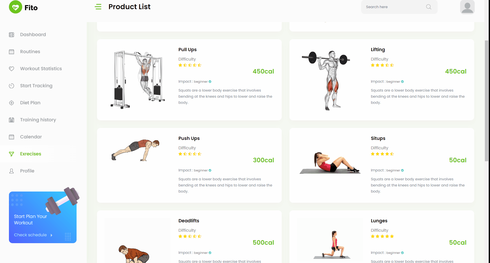

# Fito - The Fitness Tracker 🚀

Welcome to Fito, your ultimate fitness companion! Fito is more than just a fitness tracker; it's a holistic fitness management system designed to empower individuals on their journey to achieving and maintaining optimal health. With a plethora of features ranging from personalized exercise routines and diet plans to workout statistics and a calendar planner, Fito offers a tailored and dynamic approach to fitness.

## Exploring the Feature-rich Landscape of Fito 🌟

### 1. Dashboard: Your Fitness Command Center 🏅
The Dashboard serves as a dynamic command center, offering users a centralized space to gain valuable insights into their fitness progress. From summarizing workout achievements to setting new goals, this feature empowers users to stay motivated and well-informed throughout their fitness journey.\
<br>
.png)
<br>
<br>

### 2. Routines: Tailored Workouts for Optimal Results 📆
Fito's Routines feature takes personalized fitness to the next level by providing workout plans based on individual fitness levels and objectives. This structured approach ensures that users follow an optimized exercise regimen, promoting efficiency and effectiveness in their fitness routines.\
<br>
.png)
<br>
<br>

### 3. Exercise: Interactive Support for Optimal Performance 💪
Kickstart your workout sessions with Fito's Exercise feature, where integrated machine learning technology provides real-time feedback on posture. Correct form, optimize your movements, and elevate your overall fitness experience with this interactive and supportive tool.\
<br>

<br>
<br>

### 4. Workout Statistics: Data-driven Progress Tracking 🏋️
Track your fitness journey with Fito's Workout Statistics feature. This component provides month-wise graphs, allowing users to visualize progress, identify patterns, and make informed decisions to enhance their workouts based on comprehensive data.\
<br>
.png)
<br>
<br>

### 5. Food Menu: Personalized Nutrition Guidance 🥗
Achieve your fitness goals with a personalized diet plan from Fito's Food Menu. Receive nutrition recommendations tailored to your objectives, making it easier to maintain a balanced and healthy lifestyle while supporting your fitness endeavors.\
<br>
.png)
<br>
<br>

### 6. Training History: A Comprehensive Record of Achievements 💪
Fito's Training History feature allows users to keep a detailed record of their fitness activities. View day-wise logs, track personal records, and celebrate achievements, fostering motivation and a sense of accomplishment.\
<br>
.png)
<br>
<br>

### 7. Calendar: Seamless Integration of Fitness into Daily Life 🗓️
Efficiently plan future workouts using Fito's Calendar feature. Organize your fitness schedule, set reminders, and stay committed to your goals by seamlessly integrating your exercise routine into your daily life. As simple as drag and drop.\
<br>
.png)
<br>
<br>

### 8. Post workout summary: Real-time insights of current workout 🏅
This feature provides a snapshot of current exercise metrics, including duration, intensity, and calories burned. Leverage machine learning-driven form feedback to ensure correct posture, and visualize progress with dynamic rep counters and set completion status. Accessible seamlessly during workouts, the page offers a roadmap of upcoming exercises, enabling you to mentally prepare and maintain a steady flow. Experience the power of real-time updates, and after completing your workout, revisit the page for a detailed analysis to set new goals and celebrate achievements. Elevate your workout experience with Fito and embark on a path to a healthier, more active lifestyle..\
<br>
.png)
<br>

## Usage: Your Fitness Journey Begins Here 🚀

### Installation
1. Clone the repository:
   ```bash
   git clone https://github.com/Idris110/Fito-The_Fitness_Tracker.git
   cd Fito-The_Fitness_Tracker
   ```
2. Install dependencies:
   ```bash
   npm install
   ```
3. Run the flask server<br>
   The server can be accessed from :
   ```bash
   end-point: "http://localhost:port/squat|lunges|deadlift|dance"
   ```

<br>

## Crafted with cutting-edge technologies 🛠️

- **ReactJS:** Empowering the frontend with a dynamic and responsive user interface, ReactJS ensures an engaging and intuitive user experience on Fito.

- **Flask:** The backend of Fito is developed using Flask, a lightweight and versatile Python web framework that ensures efficient data processing and seamless communication between the frontend and backend components.

- **OpenCV (cv2):** Leveraging the capabilities of OpenCV, Fito incorporates computer vision for image processing, enabling features such as real-time camera interactions and form feedback during workouts.

- **MediaPipe:** Fito integrates MediaPipe to enhance the machine learning capabilities, providing accurate and real-time movement tracking for precise posture feedback during exercises.

- **Realtime Camera:** Fito utilizes real-time camera functionality to bring an interactive dimension to the user experience, enabling live feedback and engagement during exercise sessions.

- **Tailwind CSS:** Fito's aesthetic appeal and user-friendly design are achieved through the utility-first approach of Tailwind CSS, allowing for efficient and flexible styling.

These powerful technologies collectively contribute to Fito's robust and feature-rich platform, ensuring a state-of-the-art fitness management system for users on their journey towards a healthier lifestyle.
